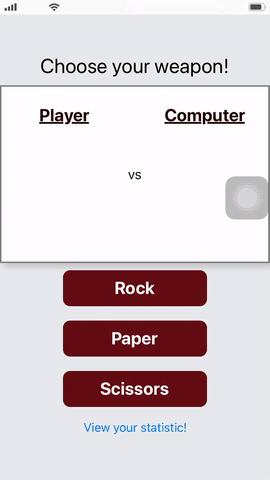

# Week 3 - Rock, Paper, Scissors 🧗‍🗞️✂️

-------
### **Introduction** 🌟

A Rock, Paper, Scissors game app 📱 using React Native & Expo.

### **Features** 🎯🥇🏆
- [x] User can select **Rock**, **Paper**, or **Scissors**
- [x] User can see **image** of their selection
- [x] User can see text of their selection
- [x] User can see **image** of computer's selection
- [x] User can see text of computer's selection
- [x] User can see **prompt** indicating who won the round

### **Rockets** 🚀
- [x] User can see how many games they've played total
- [x] User can see how games they've won, lose, tied.
- [x] User can see the percentages of wins, losses, and tie games they've had.
